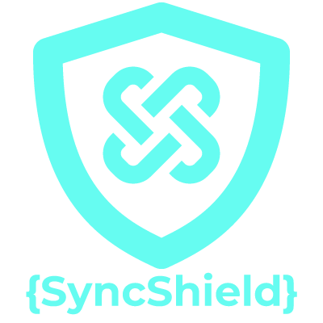

<p align="center">
  
</p>

# 🔐 SyncShield — Browser Extension for CVE-2018-5764 Detection


> **Detect unsafe Rsync commands before they become exploits**

A lightweight, privacy-focused browser extension developed as part of **Final Year Project (FYP01) NWS/129/23B** to detect missing `--protect-args` flag in Rsync commands — preventing remote command execution via **CVE-2018-5764**.

✅ Works entirely offline  
✅ No server connections or data collection  
✅ Real-time scanning & alerts  
✅ Educational & mitigation-focused  
✅ Built for students, sysadmins, and security enthusiasts

---

## 👥 Team Members

| No. | Name                                | Student ID    | Role & Responsibilities                          |
|-----|-------------------------------------|---------------|--------------------------------------------------|
| 1   | Muhammad Nur Faiz Bin Ahmad Fauzi   | NWS23070251   | Project Manager & Testing Lead                   |
| 2   | Wan Muhammad Afifuddin Bin Wan Ahmad| NWS23070157   | Backend & Functionality Developer                |
| 3   | Waleed Adam Bin Riza Farouk         | NWS23070265   | Frontend & UI/UX Developer                       |
| 4   | Roshazne Elia Binti Mohd Roshidi    | NWS23070105   | Security Analyst & Resource Coordinator          |

**Supervisor**: Sir Amir Hakeem  
**Intake**: July 2023 | **Trade**: CID (Computer Information & Data)  
**Project Code**: NWS/129/23B  
**Submission**: January 2025

---

## 🎯 Project Overview

Rsync is a powerful utility for file synchronization — but if misconfigured (especially without `--protect-args`), it can lead to **remote command execution** via specially crafted filenames or arguments (CVE-2018-5764).

SyncShield helps users:
- ✅ Paste or upload Rsync commands/scripts  
- ✅ Instantly detect unsafe patterns (missing `--protect-args`, unquoted inputs, etc.)  
- ✅ Get clear, non-technical alerts and mitigation steps  
- ✅ Learn secure Rsync practices — no CLI expertise required

> ⚠️ **Scope**: Focused only on CVE-2018-5764 — simple, targeted, and achievable within academic timeline.

---

## 🧩 Project Structure

```plaintext
SyncShield/
├── docs/       # Extension and Website source code
│   ├── css   
│   ├── images
│   ├── js
│   ├── extension   # Extension folder
│   └── index.html   # Website source code
├── LICENSE          # MIT License file
└── README.md        # You are here
```

---

## 🌐 Official SyncShield Website

[https://syncshield.my](https://syncshield.my)

---

## 🛠️ Key Features

### 1. Rsync Argument Analyzer
Scans user-inputted Rsync commands to detect absence of `--protect-args` — the critical flag that prevents shell injection.

### 2. Detection of Unsafe Input Patterns
Flags unquoted variables, shell metacharacters, and unsanitized user inputs that could trigger CVE-2018-5764.

### 3. Real-Time Alerts & Risk Warnings
Provides immediate visual feedback with:
- Risk level (Low/Medium/High)
- Plain-language explanation
- Impact summary

### 4. Mitigation Guidance
Offers actionable fixes:

```bash
# ❌ Unsafe
rsync -av /src user@host:/dest

# ✅ Safe
rsync -av --protect-args /src user@host:/dest
```

---

## 📖 Usage

Once installed, you can start using SyncShield:

1. Open the Extension  
2. Click the Extensions icon in your browser  
3. Select **SyncShield**  
4. Paste your Rsync command:  

```bash
rsync -av /src user@host:/dest
```

5. Run a Scan  
   - **Local Scan** → checks immediately in your browser  
   - **(Optional) Remote Scan** → test against a server (requires URL + token)

---

## 📦 Installation Guide

Follow these steps to install **SyncShield** in your browser:

1. **Download the Extension**  
   [Get SyncShield from our website](https://syncshield.my)
- (Only download on our website otherwise it'll download outdated extension file)

3. **Extract the Files**  
   - Unzip the downloaded `.zip` file to a folder on your computer.

4. **Open Browser Extensions Page**  
   - **Chrome / Edge / Brave** → Go to `chrome://extensions/`  
   - **Firefox** → Go to `about:debugging#/runtime/this-firefox`

5. **Enable Developer Mode**  
   - *Chrome/Edge/Brave*: Toggle the switch at the top-right.  
   - *Firefox*: No toggle required.

6. **Load the Extension**  
   - *Chrome/Edge/Brave*: Click **Load unpacked** → Select the unzipped SyncShield folder.  
   - *Firefox*: Click **Load Temporary Add-on** → Select the `manifest.json` file inside the SyncShield folder.

7. **Installation Complete 🎉**  
   - SyncShield will now appear in your extensions list and browser toolbar.

---

## 📦 Why Rsync Matters & Why SyncShield is Important

### What is Rsync?
Rsync is a powerful tool used to copy and synchronize files between computers. It’s popular because it’s fast, efficient, and saves bandwidth by only transferring changes instead of the whole file.

### The Problem
If Rsync is not used carefully, it can cause serious problems:
- A wrong command could delete important files.  
- Attackers could abuse misconfigured Rsync servers to steal data.  
- Past security issues (like CVE-2018-5764) showed that Rsync can be exploited if not properly secured.

### Why SyncShield?
SyncShield helps by:
- ✅ Checking Rsync commands before running them  
- ✅ Warning users about dangerous options (like `--delete` or overwriting files)  
- ✅ Giving safety tips to prevent data loss or attacks

---

## 🧭 User Guide

### 1. Launch SyncShield
- Launch SyncShield from your browser’s extensions menu.  
- You’ll see three tabs: **Command Scan**, **History**, and **Info**.  
- **Default tab:** **Command Scan**

### 2. Enter Your Rsync Command
- Paste or type an `rsync` command into the **Rsync Command** box.  
- If the command is invalid or incomplete, SyncShield will warn you:  
  ⚠️ “This does not look like an rsync command.”  
- Actions:  
  - Click **🔍 Local Scan** to analyze it for unsafe patterns.  
  - Click **✨ Generate Safe** to automatically rewrite the command with `--protect-args` and other secure practices.

### 3. Build a Command (Optional)
- Not sure about syntax? Use the **Command Builder**:  
  - **Source:** Path to source files (e.g. `/path/to/source`)  
  - **Destination:** Target location (e.g. `user@host:/path/to/dest`)  
  - **Options available:**  
    - `-a` Archive  
    - `-v` Verbose  
    - `-z` Compress  
    - `--progress` Show progress  
    - `--checksum` Verify integrity  
- Click **⚡ Build Secure Command** to auto-generate a safe version.

### 4. Scan with Remote Server (Optional)
- Validate with a remote host (optional). *(This feature may require additional setup such as a URL and an access token — only use with trusted hosts.)*

### 5. Review the Results
- After scanning, review:  
  - Whether the command is **Safe** or **Unsafe**  
  - Warnings, explanations, and the impact summary  
  - Suggested fixes and a **Suggested Safe Command**  
- Actions available:  
  - **Copy** the secure command to clipboard  
  - **Export** the scan results as a file for documentation

---

## 📄 License

This project is licensed under the **MIT License**. See the `LICENSE` file for details.
